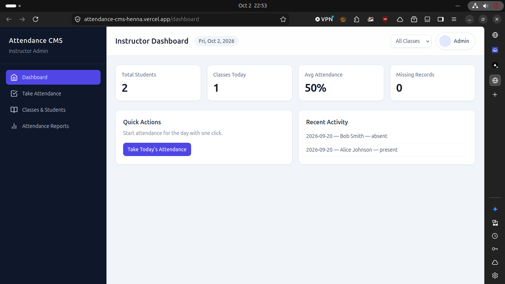

# Student Attendance Management (Phase 1)

This is a Vite + React + Tailwind prototype for a Student Attendance Management System.

Quick start:

```bash
cd /home/eddy/Desktop/CMS
npm install
npm run dev
```

Notes:
- Services in `src/services` return Promises and use localStorage for persistence.
- Data seeds are in `src/data`.
- Replace service implementations with `fetch`/`axios` to integrate a Node.js backend later.

## Screenshots
Dashboard: 
